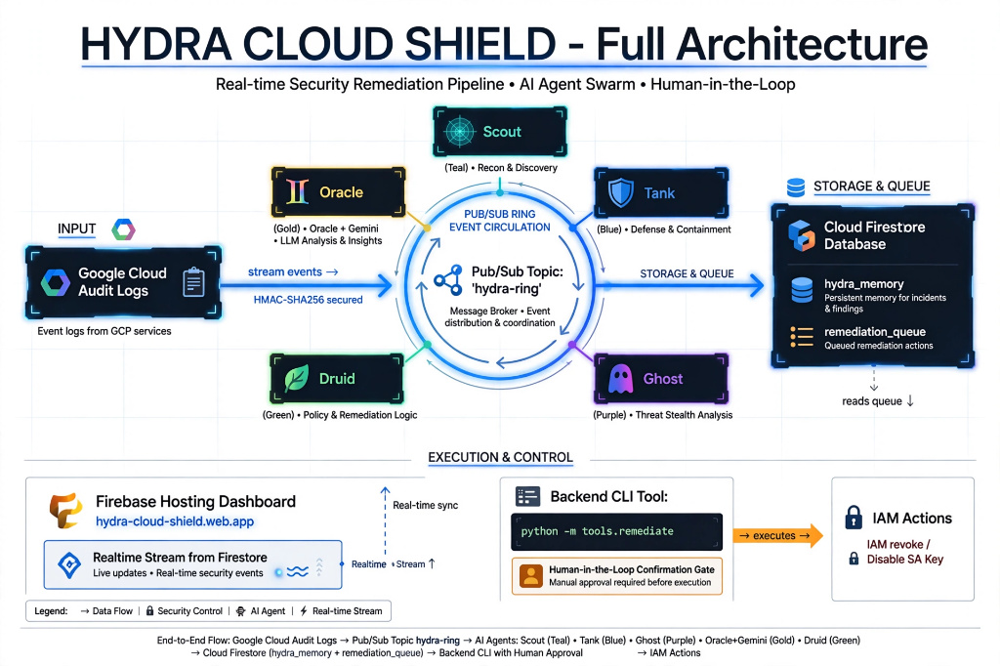
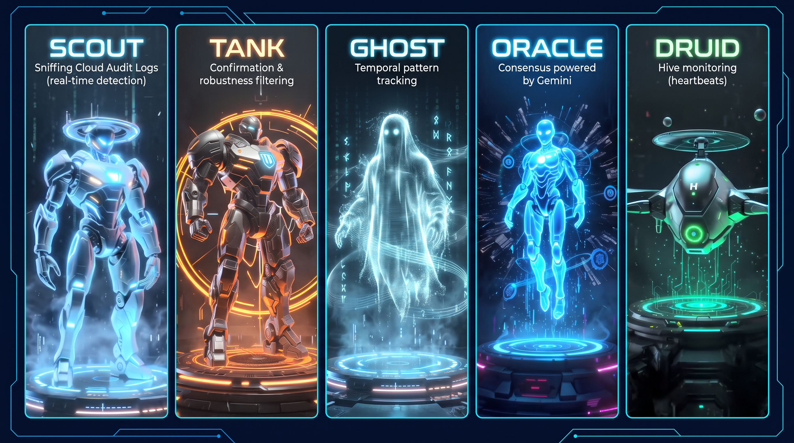

# 🐍 Hydra Cloud Shield

Distributed threat detection hive, ported to Google Cloud for the
**All Things Agentic** hackathon (**Taskmaster** track).

5 specialized agents (Scout / Tank / Ghost / Oracle / Druid) autonomously
monitor real **Cloud Audit Logs** from the GCP project, coordinate via
**Pub/Sub**, share persistent memory via **Firestore**, and the
Oracle — powered by **Gemini** — renders a consensus verdict before
proposing a real remediation action (IAM role revocation / service
account key disabling). **A human always confirms before execution.**

https://www.youtube.com/watch?v=0wXv5tIo0Sk

> Cloud port of Hydra-Smart-Shield (local prototype on Windows
> processes). See [Differences vs local version](#differences-vs-local-version)
> for porting details.

---

## Table of Contents

- [File Architecture](#file-architecture)
- [How It Works](#how-it-works)
- [The 5 Roles](#the-5-roles-in-detail)
- [Setup — From Zero to a Functional GCP Project](#setup--from-zero-to-a-functional-gcp-project)
- [Configuration (Environment Variables)](#configuration-environment-variables)
- [Running the System Locally](#running-the-system-locally)
- [Testing Each Component in Isolation](#testing-each-component-in-isolation)
- [Critical Scenario Injection (Demo Tool)](#critical-scenario-injection-demo-tool)
- [Cloud Run Deployment](#cloud-run-deployment)
- [Differences vs Local Version](#differences-vs-local-version)
- [Dashboard — Command Console](#dashboard--command-console)
- [Human Remediation Console](#human-remediation-console-toolsremediatepy)
- [Critical Test Walkthrough](#critical-test-walkthrough)
- [Progress Status](#progress-status)
- [Troubleshooting](#troubleshooting)
- [Security Philosophy](#security-philosophy)

---

## File Architecture

```
hydra-cloud/
├── main.py                    # unique entrypoint — reads BOX_ROLE and launches the correct behavior
├── requirements.txt
├── Dockerfile
├── deploy.sh                   # Cloud Run deployment (5 revisions, one per role)
├── .env.example
├── devpost_story_draft.md      # draft for Devpost "Project Story" section
│
├── config/
│   └── settings.py             # constants: GCP project, topics, thresholds, Gemini model
│
├── boxes/                      # business logic — one file per role
│   ├── base_box.py             # common abstract class (_build_features/_score contract)
│   ├── scout.py                 # BOX0 — rapid detection on raw logs
│   ├── tank.py                   # BOX1 — confirmation via Firestore history
│   ├── ghost.py                    # BOX2 — temporal patterns (schedules, bursts)
│   ├── oracle.py                    # BOX3 — consensus + Gemini call
│   └── druid.py                      # BOX4 — hive health (heartbeats)
│
├── core/                       # shared infrastructure, decoupled from role logic
│   ├── audit_log_reader.py     # pulls Cloud Audit Logs (replaces psutil)
│   ├── pubsub_ring.py           # HMAC-signed publish/subscribe (replaces UDP ring),
│   │                              also persists agent heartbeats to Firestore
│   ├── memory_store.py           # transactional Firestore (replaces memory.json)
│   ├── gemini_client.py           # google-genai wrapper, used exclusively by Oracle
│   └── remediation.py              # proposal building + persistence, real IAM actions
│
├── tools/
│   └── remediate.py            # human confirmation CLI — only legitimate entrypoint
│                                  # for executing real IAM remediation (usage: python -m tools.remediate)
│
├── dashboard/                  # mission-control web app, real-time Firestore reads
│   ├── index.html              # complete dashboard (vanilla HTML/CSS/JS, Firebase JS SDK)
│   └── 404.html                 # Firebase Hosting error page (auto-generated)
│
├── firestore.rules             # security rules — public read, client-side write blocked
├── firestore.indexes.json      # Firestore composite indexes (generated by Firebase CLI)
├── firebase.json               # Firebase Hosting config
├── .firebaserc                 # link to Firebase project
│
└── tests/
    └── test_pulse.py            # injects a synthetic critical scenario into the real pipeline
```

---

## Architecture



## How It Works

```
Cloud Audit Logs (real, generated by normal GCP project activity)
        │
        ▼
   [SCOUT] ── scans every 30s, low thresholds, priority on recall
        │
        │  publishes to "hydra-ring" Pub/Sub topic (HMAC signed)
        ▼
   [TANK] ── listens to the ring, confirms/disproves via Firestore history
        │
        ▼
   [GHOST] ── also scans logs, detects temporal patterns (independent)
        │
        └──────────────┬──────────────┘
                        ▼
                  [ORACLE] ── accumulates signals for 15s, calls Gemini,
                              renders a structured JSON verdict
                        │
                        ▼
              Critical verdict? ──yes──▶ proposes remediation
                        │                  (NEVER executed automatically)
                        │
                        ▼
              Writes verdict to Firestore (hydra_memory)
                        │
                        ▼
        Next encounter with this identity → immediate decision,
        no recalculation (memorized "safe"/"sandbox" verdict)

   [DRUID] ── in parallel, listens to the ring for heartbeats,
              alerts if a box goes silent for >90s
```

Every box periodically publishes a dedicated heartbeat (independent of
whether it has anything to report) and persists it to Firestore — this
lets Druid distinguish "silent" from "nothing to report this cycle",
and lets the live dashboard show each agent's real-time status.

---

## The 5 Roles In Detail

## Architecture




| Box | Source File | Data Source | What It Does |
|-----|-------------|--------------|----------------|
| **Scout** | `boxes/scout.py` | Cloud Audit Logs (direct poll) | First alert, low thresholds (≥20/100), detects risky IAM methods and monitored severities |
| **Tank** | `boxes/tank.py` | Ring (Scout messages only) | Confirms/disproves via Firestore history of the identity, short-circuits if verdict already known |
| **Ghost** | `boxes/ghost.py` | Cloud Audit Logs (direct poll) | Temporal patterns: off-hours (1am–5am UTC), activity bursts, never-seen identities |
| **Oracle** | `boxes/oracle.py` | Ring (all signals) | Aggregates over a 15s window, calls Gemini for the final verdict, proposes remediation if critical |
| **Druid** | `boxes/druid.py` | Ring (heartbeats) | Monitors the hive's own health, alerts if a box goes silent |


---

## Setup — From Zero To A Functional GCP Project

### 1. Create the GCP project (if not already done)

```bash
gcloud projects create YOUR_PROJECT_ID
gcloud config set project YOUR_PROJECT_ID
```

### 2. Enable the required APIs

```bash
gcloud services enable \
  logging.googleapis.com \
  pubsub.googleapis.com \
  firestore.googleapis.com \
  aiplatform.googleapis.com \
  run.googleapis.com
```

### 3. Create the Firestore database (native mode, once per project)

```bash
gcloud firestore databases create --location=eur3
```

### 4. Authenticate locally

```bash
gcloud auth login
gcloud auth application-default login
```

### 5. Install Python dependencies

```bash
pip install -r requirements.txt
```

### 6. Get a Gemini API key (if not authenticating via Vertex AI/ADC)

Go to [aistudio.google.com/apikey](https://aistudio.google.com/apikey),
generate a key, put it in `GEMINI_API_KEY` (see config section below).

---

## Configuration (Environment Variables)

Copy `.env.example` to `.env` and fill in:

| Variable | Required | Description |
|----------|:---:|--------------|
| `GCP_PROJECT_ID` | ✅ | Your GCP project ID |
| `HYDRA_RING_HMAC_KEY` | ✅ | Shared secret used to sign ring packets — generate with `openssl rand -hex 32` |
| `BOX_ROLE` | ✅ | `scout` / `tank` / `ghost` / `oracle` / `druid` |
| `GEMINI_API_KEY` | depends on SDK | Gemini API key (if not authenticating via Vertex AI/ADC) |
| `GEMINI_MODEL` | no | Defaults in `config/settings.py` |

Without `GCP_PROJECT_ID` or `HYDRA_RING_HMAC_KEY`, `main.py` refuses to
start and clearly prints what's missing — intentional (see
`_check_env()` in `main.py`), to avoid a silent crash post-deployment.

**Never commit `.env`** or paste real key values into terminal
recordings, screenshots, or demo videos — treat both keys above as
secrets on par with a password.

---

## Running The System Locally

Each box runs as its own process. Open 5 terminals (or use `tmux`/`screen`):

```bash
export GCP_PROJECT_ID=your-project-id
export HYDRA_RING_HMAC_KEY=your-generated-key
export GEMINI_API_KEY=your-gemini-key

# Terminal 1
BOX_ROLE=scout python main.py

# Terminal 2
BOX_ROLE=tank python main.py

# Terminal 3
BOX_ROLE=ghost python main.py

# Terminal 4
BOX_ROLE=oracle python main.py

# Terminal 5
BOX_ROLE=druid python main.py
```

If everything is configured correctly, you should see:
- Scout and Ghost scanning logs every 30s (`SCAN_INTERVAL_SECONDS`)
- As soon as an event exceeds the threshold (≥20/100), Scout/Ghost publish to the ring
- Tank reacting to Scout's publications
- Oracle accumulating for 15s, then calling Gemini and printing the verdict
- Druid printing "Hive health: nominal" every 30s

To generate real test activity quickly without waiting for a natural
IAM event: make a minor IAM change on your project (e.g. add then
remove a role on a test account) — this immediately produces a real
Cloud Audit Log entry.

---

## Testing Each Component In Isolation

### `audit_log_reader.py` — verify logs are read correctly

```bash
python -m core.audit_log_reader
```

### `pubsub_ring.py` — verify publish/listen work

```bash
python3 -c "
from core.pubsub_ring import RingClient
r = RingClient('test')
r.publish({'proc_or_event_id': 'test-1', 'identity': 'test@example.com', 'score': 42})
print('published successfully')
"
```

### `memory_store.py` — verify Firestore

```bash
python3 -c "
from core.memory_store import MemoryStore
m = MemoryStore()
m.record_encounter('test@example.com', 42, 'test_box')
print(m.get('test@example.com'))
"
```

### `gemini_client.py` — verify the Gemini call in isolation

```bash
python3 -c "
from core.gemini_client import get_consensus_verdict
verdict = get_consensus_verdict(
    {'identity': 'test@example.com'},
    [{'source_role': 'scout', 'score': 60, 'confidence': 0.6, 'raisons': ['test']}],
    None
)
print(verdict)
"
```

---

## Critical Scenario Injection (Demo Tool)

`tests/test_pulse.py` injects a **synthetic** critical signal into the
real pipeline — real signed Pub/Sub packet, real Tank confirmation,
real Oracle → Gemini call, real Firestore write, real dashboard update.
Nothing about the infrastructure is faked; only the triggering event
is synthetic, and it's clearly tagged as a demo identity
(`demo-critical-scenario@...`). Useful for a reliable, reproducible
demo without waiting for a real IAM incident.

Prerequisite: Scout, Tank, Oracle, and Druid should already be running.

```bash
python -m tests.test_pulse
```

Watch Tank and Oracle's terminals, and the live dashboard — Oracle
accumulates signals for ~15s before calling Gemini and rendering a
verdict.

---

## Cloud Run Deployment

1. Fill in `PROJECT_ID` in `deploy.sh`
2. Make sure `HYDRA_RING_HMAC_KEY` and `GEMINI_API_KEY` go through
   Secret Manager rather than plain text in the script
3. Run:
   ```bash
   chmod +x deploy.sh
   ./deploy.sh
   ```
   This builds the image once and deploys 5 Cloud Run revisions (one
   per role), each with `min-instances=1 max-instances=1` to guarantee
   exactly one running instance per role (no horizontal scaling here —
   each role is a logical singleton).

---

## Differences vs Local Version

| Before (Hydra-Smart-Shield, local) | Now (Hydra Cloud Shield) |
|--------------------------------------|------------------------------|
| `psutil` (Windows process scanning) | Cloud Audit Logs (Cloud Logging API) |
| UDP ring (local sockets, ports 9990–9994) | Pub/Sub (`hydra-ring` topic) |
| `memory.json` (file + symlink + `threading.Lock`) | Firestore (`hydra_memory` collection, native transactions) |
| Homegrown heuristic scoring only | Heuristic scoring **+** Gemini verdict (Oracle) |
| Quarantine = suspend PID + copy executable | Remediation = revoke IAM role / disable service account key |
| 5 separate Python processes (`BOX0.py`…`BOX4.py`) | 1 codebase, role selected via `BOX_ROLE` |
| Local Tkinter GUI | Real-time web dashboard (Firebase Hosting + live Firestore) |

---

## Dashboard — Command Console

A static web dashboard (vanilla HTML/CSS/JS, no framework or build
step) reads Firestore in real time client-side via the Firebase JS
SDK. It displays:

- **Live agent status** — each of the 5 agent cards shows a pulsing
  indicator (active / stale / offline) based on real persisted
  heartbeats, refreshed client-side every 5s
- **Live verdict stream** (`hydra_memory`), no page refresh needed
- **Pending remediation proposals** (`hydra_remediation_proposals`)
- **Remediation history** — resolved proposals (executed / rejected /
  skipped / failed) with color-coded status badges

**Live demo:** https://hydra-cloud-shield.web.app

### Deploy / update the dashboard

```bash
npm install -g firebase-tools   # once
firebase login                   # once
firebase deploy --only hosting
```

### Client-side Firestore security

The dashboard reads Firestore directly from the browser (no
intermediate backend), so the security rules (`firestore.rules`) are
what actually protect the data — not the Firebase `apiKey` (which is
public by design and visible in source code; it is not a secret).
Current rules: public read on `hydra_memory`,
`hydra_remediation_proposals`, and `hydra_agent_status`; write blocked
for all client access (only the Python backend, authenticated via
`gcloud`, can write).

```bash
firebase deploy --only firestore:rules
```

---

## Human Remediation Console (`tools/remediate.py`)

The only legitimate entrypoint to execute a real IAM action. Oracle
only ever **proposes** (`core.remediation.propose`), which persists
the proposal in Firestore with status `pending_human_confirmation`.
This script lists proposals, displays them one by one, and only
executes the real action after explicit confirmation — you must type
`CONFIRMER` in full, not just `y`, for a destructive action.

```bash
python -m tools.remediate
```

For each proposal: **[E]**xecute, **[I]**gnore (rejects permanently),
or **[S]**kip (leaves pending for later).

---

## Critical Test Walkthrough

**Alert injection** — A critical test pulse (`tests/test_pulse.py`) is
injected to simulate a suspicious privilege escalation (assigning the
`roles/owner` role outside business hours).

**Detection & analysis** — Scout rapidly picks up the anomaly; the
Gemini-powered Oracle analyzes the accumulated signals, renders a
critical verdict (e.g. `CRITICAL · 82/100`), and automatically
proposes a remediation action (`revoke_iam_role` or
`disable_service_account_key`, depending on Gemini's read of the
signals).

**Human-in-the-loop remediation** — The proposal is instantly
reflected on the live mission-control dashboard and processed through
`tools/remediate.py`, letting an operator review the details and
safely execute, ignore, or skip the action. Every decision — executed
or ignored — is written back to Firestore and shown in the
dashboard's remediation history within seconds.

---

## Progress Status

### ✅ Done
- All 5 boxes (Scout, Tank, Ghost, Oracle, Druid) — complete logic, tested end-to-end in real conditions
- `core/audit_log_reader.py`, `pubsub_ring.py`, `memory_store.py`, `gemini_client.py` — validated individually and in integration
- `core/remediation.py` — `propose()` fully functional, persists to Firestore
- `tools/remediate.py` — human confirmation CLI, `execute_disable_service_account_key` and `execute_revoke_iam_role` implemented (via `iam_admin_v1` and `resourcemanager_v3`)
- `main.py` — real dispatch to each box based on `BOX_ROLE`
- GCP project `hydra-cloud-shield` created, required APIs enabled (Logging, Pub/Sub, Firestore, Vertex AI)
- Firestore (`eur3` region) created and functional
- All 5 boxes run together for real, communicate over Pub/Sub, Oracle renders coherent verdicts via Gemini
- Heartbeat persistence: every box writes its heartbeat to Firestore, not just to the ephemeral Pub/Sub ring — powers both Druid's health checks and the dashboard's live status
- Mission-control dashboard publicly deployed on Firebase Hosting, with live agent status and remediation history
- `tests/test_pulse.py` — reliable, reproducible critical-scenario injection for demo purposes

### ⏳ Last updates
- [ ] Cloud Run deployment — Bypassed via Cloud Shell orchestration and local runtimes due to credit limits (Architecture fully validated).
- [ ] Secret Manager migration — Move sensitive keys (HYDRA_RING_HMAC_KEY, GEMINI_API_KEY) to Secret Manager (Nice-to-have security hardening).
- [ ] Final architecture diagram — Final architecture diagram for the Devpost submission (Last visual pending, almost done).
- [ ] ~4 min demo video recorded, edited, and ready to go.
- [ ] Public GitHub repository.
- [ ] devpost_story_draft.md written, polished, and validated.

---

## Troubleshooting

**`RuntimeError: GCP_PROJECT_ID not configured`**
→ Missing env var. `export GCP_PROJECT_ID=your-project-id` before running.

**`RuntimeError: HYDRA_RING_HMAC_KEY not configured`**
→ Generate a key: `export HYDRA_RING_HMAC_KEY=$(openssl rand -hex 32)`.
Must be identical across all boxes, or they'll reject each other's
packets (invalid signature).

**No events detected by Scout/Ghost**
→ Normal on a low-activity project. Generate an IAM event (add/remove
a role on a test account) and rerun `python -m core.audit_log_reader`
to confirm it comes through.

**`[RING] ⚠️ Packet rejected — invalid signature`**
→ Check that `HYDRA_RING_HMAC_KEY` is identical across all running boxes.

**`[GEMINI_CLIENT] ⚠️ Gemini call failed: 'ascii' codec can't encode character...`**
→ System locale issue (common on freshly installed WSL/Debian, which
sometimes defaults to ASCII rather than UTF-8). Fix with:
```bash
export LANG=C.UTF-8
export LC_ALL=C.UTF-8
export PYTHONUTF8=1
```
Add these 3 lines to `~/.bashrc` to make it permanent.

**Firestore/Pub/Sub/Logging permission error**
→ Confirm `gcloud auth application-default login` was run, and that
the required APIs are enabled (`gcloud services list --enabled`).

**Gemini returns something imperfect**
→ `gemini_client.py` has an automatic fallback (`_parse_verdict`) that
returns a `suspect/monitor` verdict if the JSON is malformed — this
should never crash a box, just print a warning.

---

## Security Philosophy

**REPAIR only, never offensive action.** Directly inherited from the
local version (`sandbox_engine.py` already said "the human always
decides"):

- `remediation.propose()` never modifies anything on the IAM side — it
  only builds and persists a dict describing the recommended action.
- `execute_disable_service_account_key()` and `execute_revoke_iam_role()`
  are never called automatically by Oracle or any box — only from
  `tools/remediate.py`, after explicit human confirmation.
- Ring packets are HMAC-SHA256 signed to prevent third-party injection
  of fake scores.
- Any external call failure (Cloud Logging, Pub/Sub, Firestore,
  Gemini) is caught and logged rather than crashing a box — the system
  is designed to run autonomously without constant supervision.


  ### Thank you!


*Built solo with ❤️ and a lot of caffeine for Google Cloud x RAGE Hackathon*